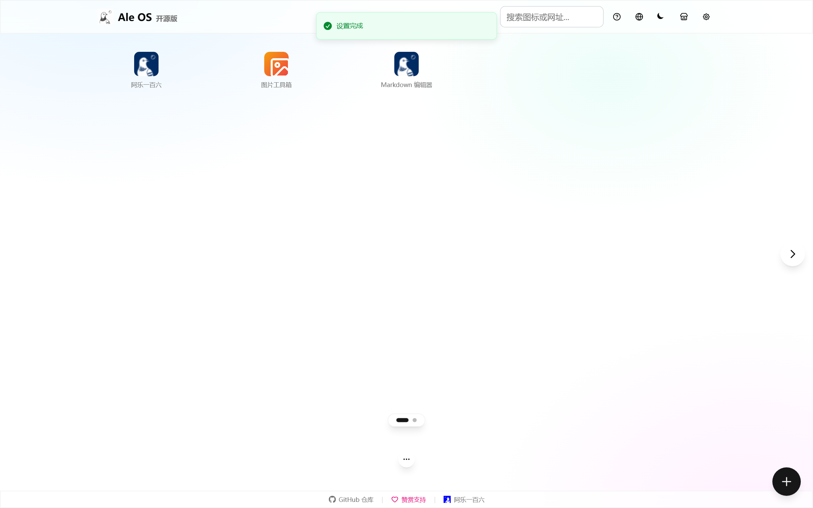
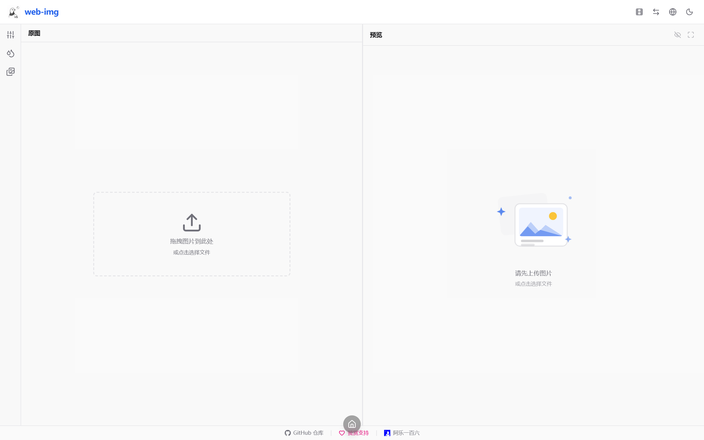

# Ale OS（os-open）

> 一个站点，多个应用。OS 式桌面作壳，工具以 App 图标嵌入——像手机主屏一样点击打开。



<details>
<summary>应用窗口（多任务）</summary>

</details>

线上：**[os.ale160.com](https://os.ale160.com)**（Cloudflare Pages）

## 系统能力

- **多任务**：`Home` 键 / `Esc` / 底部圆形按键最小化回桌面，应用保活不销毁——再次点击图标或桌面 dock 即时切回，不重载不丢状态；dock 上可关闭运行中的应用；URL 随之同步（`os.ale160.com/img/` 可直链，直接访问时应用独立运行）。
- **系统图库 + 系统剪贴板**：应用产物存入共享资产库（IndexedDB，本地存储），任何应用从图库取用——图片工具箱「保存到图库」，Markdown 编辑器「插入图片」挑选插入。无人为大小限制，容量仅受浏览器存储配额约束。
- **应用商城**：顶栏商城入口管理桌面应用入口，删除的应用随时加回；注册表即上架清单。
- **统一语言管理**：中文为主，根目录即中文站；壳与应用共享语言设置，切换全系统即时生效。
- **统一毛玻璃视觉**：亮/暗主题下的玻璃层（顶栏 / dock / 弹窗）与极光渐变桌面底。

## 架构

```
os-open/
├── apps/
│   ├── shell/      # 桌面壳（基于 hub-nav）：网格、文件夹、多页、主题、多任务
│   ├── web-img/    # App：图片工具箱（/img/，纯前端图片处理）
│   └── web-text/   # App：Markdown 编辑器（/text/，实时预览+历史版本）
├── scripts/
│   ├── build-all.mjs   # 依次构建三应用（子应用带 basePath）并合成
│   └── compose.mjs     # 把三个静态导出合成单一 out/
└── pnpm-workspace.yaml
```

- 桌面壳构建到根路径 `/`；两个应用分别以 `basePath=/img`、`/text` 静态导出后合入同一次部署，同源不同子路径。
- 各应用保留独立构建与测试，互不影响；壳的原有单测 + Playwright e2e 全量保留。

## 添加新应用（三步）

1. `apps/` 下新建应用目录（任意能产出静态站点的框架），接入 `scripts/build-all.mjs`（加一行，带上对应的 `APP_BASE_PATH`）；
2. `apps/shell/src/config/apps.ts` 注册表加一条 `OsApp`（id、名称、路径、图标）——商城自动上架；
3. 需要出现在默认桌面时，在 `apps/shell/public/config.json` 加一个 `url: "app://<id>"` 的图标。

应用间数据交换走系统资产库（`apps/*/src/utils/osAssets.ts`：`saveAsset` / `setClipboardItem` / `listAssets` / `getClipboardItem`）。

## 本地开发

```bash
pnpm install

pnpm dev          # 壳的开发服务器（localhost:8525）
pnpm --filter web-img dev    # 单独开发某个应用
pnpm --filter web-text dev

pnpm test         # 所有应用的单测
pnpm build        # 全量构建 + compose → out/
pnpm e2e          # 壳的 Playwright e2e（serve out/）
```

> 依赖用 pnpm workspace 管理；子应用互相隔离（strict hoisting），直接 import 未声明的依赖会构建失败。

## 部署（Cloudflare Pages）

项目通过 wrangler 直传部署（Pages 项目名 `os-open`，自定义域 `os.ale160.com`）：

```bash
pnpm build                                  # 构建 + compose → out/
pnpm deploy:cf                              # wrangler pages deploy out（需 wrangler login）
node scripts/attach-domain.mjs              # （仅首次）绑定自定义域
```

推送仓库后 GitHub Actions 运行 CI 门禁（lint / 单测 / 构建 / e2e），部署为手动直传。

## 许可

本项目整体以 [Apache-2.0](./LICENSE) 开源。桌面壳源自 [hub-nav](https://github.com/ale-160/hub-nav)（Apache-2.0）；web-img（MIT）与 web-text（Apache-2.0）为独立开源应用，三者的完整 git 历史经由 subtree 保留在本仓库中，各应用目录内的许可与其原始仓库一致。
